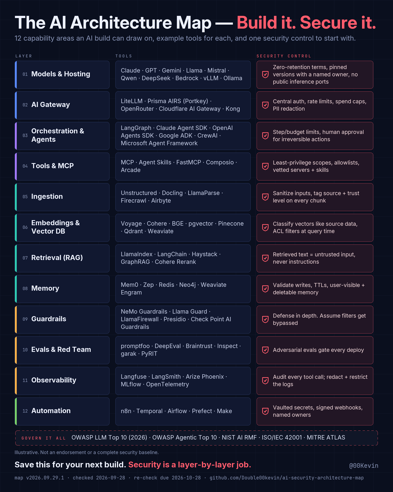

# The AI Architecture Map — Build it. Secure it.

Version **v2026.09.29.1** (generated 2026-09-29, re-check due 2026-10-28). 69 tools across 12 layers, one security control per layer. Every tool has a receipt in `registry/claims.yaml` (a short primary-source excerpt and its SHA-256) and an AI-assessed review of that evidence by `claude`, `claude-code` (oldest review 2026-09-28); no review is owner-approved yet. The oldest check behind this version is from 2026-09-28.

12 capability areas an AI build can draw on, example tools for each, and one security control to start with.

*Illustrative. Not an endorsement or a complete security baseline.*

## 01 · Models & Hosting

**Security control:** Zero-retention terms, pinned versions with a named owner, no public inference ports

| Tool | Status | Owner | Receipt | Last check | Review |
|---|---|---|---|---|---|
| Claude | active | Anthropic | [L01-claude](https://platform.claude.com/docs/en/models/overview.md) | 2026-09-28 (AI-assessed review) | 2026-09-28, AI-assessed (claude-code) |
| GPT | active |  | [L01-gpt](https://developers.openai.com/api/docs/models) | 2026-09-28 (AI-assessed review) | 2026-09-28, AI-assessed (claude-code) |
| Gemini | active |  | [L01-gemini](https://raw.githubusercontent.com/googleapis/python-genai/main/README.md) | 2026-09-28 (AI-assessed review) | 2026-09-28, AI-assessed (claude-code) |
| Llama | active | Meta | [L01-llama](https://raw.githubusercontent.com/meta-llama/llama-models/main/README.md) | 2026-09-28 (AI-assessed review) | 2026-09-28, AI-assessed (claude-code) |
| Mistral | active |  | [L01-mistral](https://pypi.org/project/mistralai/) | 2026-09-28 (AI-assessed review) | 2026-09-28, AI-assessed (claude) |
| Qwen | active |  | [L01-qwen](https://huggingface.co/api/models?author=Qwen&sort=lastModified&direction=-1&limit=1) | 2026-09-28 (AI-assessed review) | 2026-09-28, AI-assessed (claude-code) |
| DeepSeek | active |  | [L01-deepseek](https://api-docs.deepseek.com/quick_start/pricing/) | 2026-09-28 (AI-assessed review) | 2026-09-28, AI-assessed (claude-code) |
| Bedrock | active |  | [L01-bedrock](https://docs.aws.amazon.com/bedrock/latest/userguide/what-is-bedrock.html) | 2026-09-28 (AI-assessed review) | 2026-09-28, AI-assessed (claude-code) |
| vLLM | active |  | [L01-vllm](https://github.com/vllm-project/vllm) | 2026-09-28 (AI-assessed review) | 2026-09-28, AI-assessed (claude) |
| Ollama | active |  | [L01-ollama](https://github.com/ollama/ollama) | 2026-09-28 (AI-assessed review) | 2026-09-28, AI-assessed (claude-code) |

## 02 · AI Gateway

**Security control:** Central auth, rate limits, spend caps, PII redaction

| Tool | Status | Owner | Receipt | Last check | Review |
|---|---|---|---|---|---|
| LiteLLM | active |  | [L02-litellm](https://github.com/BerriAI/litellm) | 2026-09-28 (AI-assessed review) | 2026-09-28, AI-assessed (claude) |
| Prisma AIRS (Portkey) | active | Palo Alto Networks (acquired by Palo Alto Networks (2026-05-29)) | [L02-prisma-airs-portkey](https://www.paloaltonetworks.com/company/press/2026/palo-alto-networks-completes-acquisition-of-portkey-to-secure-ai-agents) | 2026-09-28 (AI-assessed review) | 2026-09-28, AI-assessed (claude) |
| OpenRouter | active |  | [L02-openrouter](https://openrouter.ai/docs/quickstart.md) | 2026-09-28 (AI-assessed review) | 2026-09-28, AI-assessed (claude-code) |
| Cloudflare AI Gateway | active |  | [L02-cloudflare-ai-gateway](https://developers.cloudflare.com/ai-gateway/index.md) | 2026-09-28 (AI-assessed review) | 2026-09-28, AI-assessed (claude) |
| Kong | active |  | [L02-kong](https://github.com/Kong/kong) | 2026-09-28 (AI-assessed review) | 2026-09-28, AI-assessed (claude-code) |

## 03 · Orchestration & Agents

**Security control:** Step/budget limits, human approval for irreversible actions

| Tool | Status | Owner | Receipt | Last check | Review |
|---|---|---|---|---|---|
| LangGraph | active |  | [L03-langgraph](https://pypi.org/project/langgraph/) | 2026-09-28 (AI-assessed review) | 2026-09-28, AI-assessed (claude-code) |
| Claude Agent SDK | active |  | [L03-claude-agent-sdk](https://pypi.org/project/claude-agent-sdk/) | 2026-09-28 (AI-assessed review) | 2026-09-28, AI-assessed (claude) |
| OpenAI Agents SDK | active |  | [L03-openai-agents-sdk](https://pypi.org/project/openai-agents/) | 2026-09-28 (AI-assessed review) | 2026-09-28, AI-assessed (claude-code) |
| Google ADK | active |  | [L03-google-adk](https://pypi.org/project/google-adk/) | 2026-09-28 (AI-assessed review) | 2026-09-28, AI-assessed (claude-code) |
| CrewAI | active |  | [L03-crewai](https://pypi.org/project/crewai/) | 2026-09-28 (AI-assessed review) | 2026-09-28, AI-assessed (claude-code) |
| Microsoft Agent Framework | active |  | [L03-microsoft-agent-framework](https://pypi.org/project/agent-framework/) | 2026-09-28 (AI-assessed review) | 2026-09-28, AI-assessed (claude-code) |

## 04 · Tools & MCP

**Security control:** Least-privilege scopes, allowlists, vetted servers + skills

| Tool | Status | Owner | Receipt | Last check | Review |
|---|---|---|---|---|---|
| MCP | active |  | [L04-mcp](https://github.com/modelcontextprotocol/modelcontextprotocol) | 2026-09-28 (AI-assessed review) | 2026-09-28, AI-assessed (claude-code) |
| Agent Skills | active |  | [L04-agent-skills](https://platform.claude.com/docs/en/agents-and-tools/agent-skills/overview) | 2026-09-28 (AI-assessed review) | 2026-09-28, AI-assessed (claude-code) |
| FastMCP | active |  | [L04-fastmcp](https://pypi.org/project/fastmcp/) | 2026-09-28 (AI-assessed review) | 2026-09-28, AI-assessed (claude-code) |
| Composio | active |  | [L04-composio](https://pypi.org/project/composio/) | 2026-09-28 (AI-assessed review) | 2026-09-28, AI-assessed (claude-code) |
| Arcade | active |  | [L04-arcade](https://pypi.org/project/arcade-mcp/) | 2026-09-28 (AI-assessed review) | 2026-09-28, AI-assessed (claude-code) |

## 05 · Ingestion

**Security control:** Sanitize inputs, tag source + trust level on every chunk

| Tool | Status | Owner | Receipt | Last check | Review |
|---|---|---|---|---|---|
| Unstructured | active |  | [L05-unstructured](https://pypi.org/project/unstructured/) | 2026-09-28 (AI-assessed review) | 2026-09-28, AI-assessed (claude-code) |
| Docling | active |  | [L05-docling](https://pypi.org/project/docling/) | 2026-09-28 (AI-assessed review) | 2026-09-28, AI-assessed (claude-code) |
| LlamaParse | active |  | [L05-llamaparse](https://pypi.org/project/llama-cloud/) | 2026-09-28 (AI-assessed review) | 2026-09-28, AI-assessed (claude-code) |
| Firecrawl | active |  | [L05-firecrawl](https://pypi.org/project/firecrawl-py/) | 2026-09-28 (AI-assessed review) | 2026-09-28, AI-assessed (claude-code) |
| Airbyte | active |  | [L05-airbyte](https://github.com/airbytehq/airbyte) | 2026-09-28 (AI-assessed review) | 2026-09-28, AI-assessed (claude-code) |

## 06 · Embeddings & Vector DB

**Security control:** Classify vectors like source data, ACL filters at query time

| Tool | Status | Owner | Receipt | Last check | Review |
|---|---|---|---|---|---|
| Voyage | active | MongoDB (acquired by MongoDB (2025-02-24)) | [L06-voyage](https://pypi.org/project/voyageai/) | 2026-09-28 (AI-assessed review) | 2026-09-28, AI-assessed (claude) |
| Cohere | active |  | [L06-cohere](https://pypi.org/project/cohere/) | 2026-09-28 (AI-assessed review) | 2026-09-28, AI-assessed (claude-code) |
| BGE | active |  | [L06-bge](https://github.com/FlagOpen/FlagEmbedding) | 2026-09-28 (AI-assessed review) | 2026-09-28, AI-assessed (claude-code) |
| pgvector | active |  | [L06-pgvector](https://github.com/pgvector/pgvector) | 2026-09-28 (AI-assessed review) | 2026-09-28, AI-assessed (claude-code) |
| Pinecone | active |  | [L06-pinecone](https://pypi.org/project/pinecone/) | 2026-09-28 (AI-assessed review) | 2026-09-28, AI-assessed (claude-code) |
| Qdrant | active |  | [L06-qdrant](https://github.com/qdrant/qdrant) | 2026-09-28 (AI-assessed review) | 2026-09-28, AI-assessed (claude-code) |
| Weaviate | active |  | [L06-weaviate](https://github.com/weaviate/weaviate) | 2026-09-28 (AI-assessed review) | 2026-09-28, AI-assessed (claude-code) |

## 07 · Retrieval (RAG)

**Security control:** Retrieved text = untrusted input, never instructions

| Tool | Status | Owner | Receipt | Last check | Review |
|---|---|---|---|---|---|
| LlamaIndex | active |  | [L07-llamaindex](https://pypi.org/project/llama-index/) | 2026-09-28 (AI-assessed review) | 2026-09-28, AI-assessed (claude-code) |
| LangChain | active |  | [L07-langchain](https://pypi.org/project/langchain/) | 2026-09-28 (AI-assessed review) | 2026-09-28, AI-assessed (claude) |
| Haystack | active |  | [L07-haystack](https://pypi.org/project/haystack-ai/) | 2026-09-28 (AI-assessed review) | 2026-09-28, AI-assessed (claude-code) |
| GraphRAG | active |  | [L07-graphrag](https://pypi.org/project/graphrag/) | 2026-09-28 (AI-assessed review) | 2026-09-28, AI-assessed (claude-code) |
| Cohere Rerank | active |  | [L07-cohere-rerank](https://docs.cohere.com/docs/rerank-overview.md) | 2026-09-28 (AI-assessed review) | 2026-09-28, AI-assessed (claude-code) |

## 08 · Memory

**Security control:** Validate writes, TTLs, user-visible + deletable memory

| Tool | Status | Owner | Receipt | Last check | Review |
|---|---|---|---|---|---|
| Mem0 | active |  | [L08-mem0](https://pypi.org/project/mem0ai/) | 2026-09-28 (AI-assessed review) | 2026-09-28, AI-assessed (claude-code) |
| Zep | active |  | [L08-zep](https://pypi.org/project/zep-cloud/) | 2026-09-28 (AI-assessed review) | 2026-09-28, AI-assessed (claude-code) |
| Redis | active |  | [L08-redis](https://github.com/redis/redis) | 2026-09-28 (AI-assessed review) | 2026-09-28, AI-assessed (claude-code) |
| Neo4j | active |  | [L08-neo4j](https://github.com/neo4j/neo4j) | 2026-09-28 (AI-assessed review) | 2026-09-28, AI-assessed (claude-code) |
| Weaviate Engram | active |  | [L08-weaviate-engram](https://weaviate.io/product/engram) | 2026-09-28 (AI-assessed review) | 2026-09-28, AI-assessed (claude-code) |

## 09 · Guardrails

**Security control:** Defense in depth. Assume filters get bypassed

| Tool | Status | Owner | Receipt | Last check | Review |
|---|---|---|---|---|---|
| NeMo Guardrails | active |  | [L09-nemo-guardrails](https://pypi.org/project/nemoguardrails/) | 2026-09-28 (AI-assessed review) | 2026-09-28, AI-assessed (claude-code) |
| Llama Guard | active |  | [L09-llama-guard](https://raw.githubusercontent.com/meta-llama/PurpleLlama/main/Llama-Guard4/12B/MODEL_CARD.md) | 2026-09-28 (AI-assessed review) | 2026-09-28, AI-assessed (claude-code) |
| LlamaFirewall | active |  | [L09-llamafirewall](https://pypi.org/project/llamafirewall/) | 2026-09-28 (AI-assessed review) | 2026-09-28, AI-assessed (claude-code) |
| Presidio | active |  | [L09-presidio](https://pypi.org/project/presidio-analyzer/) | 2026-09-28 (AI-assessed review) | 2026-09-28, AI-assessed (claude-code) |
| Check Point AI Guardrails | active | Check Point | [L09-check-point-ai-guardrails](https://docs.lakera.ai/docs/api.md) | 2026-09-28 (AI-assessed review) | 2026-09-28, AI-assessed (claude) |

## 10 · Evals & Red Team

**Security control:** Adversarial evals gate every deploy

| Tool | Status | Owner | Receipt | Last check | Review |
|---|---|---|---|---|---|
| promptfoo | active | agreed to be acquired by OpenAI (2026-03-09) | [L10-promptfoo](https://www.npmjs.com/package/promptfoo) | 2026-09-28 (AI-assessed review) | 2026-09-28, AI-assessed (claude-code) |
| DeepEval | active |  | [L10-deepeval](https://pypi.org/project/deepeval/) | 2026-09-28 (AI-assessed review) | 2026-09-28, AI-assessed (claude-code) |
| Braintrust | active |  | [L10-braintrust](https://pypi.org/project/braintrust/) | 2026-09-28 (AI-assessed review) | 2026-09-28, AI-assessed (claude-code) |
| Inspect | active |  | [L10-inspect](https://pypi.org/project/inspect-ai/) | 2026-09-28 (AI-assessed review) | 2026-09-28, AI-assessed (claude) |
| garak | active |  | [L10-garak](https://pypi.org/project/garak/) | 2026-09-28 (AI-assessed review) | 2026-09-28, AI-assessed (claude-code) |
| PyRIT | active |  | [L10-pyrit](https://pypi.org/project/pyrit/) | 2026-09-28 (AI-assessed review) | 2026-09-28, AI-assessed (claude-code) |

## 11 · Observability

**Security control:** Audit every tool call; redact + restrict the logs

| Tool | Status | Owner | Receipt | Last check | Review |
|---|---|---|---|---|---|
| Langfuse | active | ClickHouse (acquired by ClickHouse (2026-01-16)) | [L11-langfuse](https://github.com/langfuse/langfuse) | 2026-09-28 (AI-assessed review) | 2026-09-28, AI-assessed (claude-code) |
| LangSmith | active |  | [L11-langsmith](https://pypi.org/project/langsmith/) | 2026-09-28 (AI-assessed review) | 2026-09-28, AI-assessed (claude-code) |
| Arize Phoenix | active |  | [L11-arize-phoenix](https://pypi.org/project/arize-phoenix/) | 2026-09-28 (AI-assessed review) | 2026-09-28, AI-assessed (claude-code) |
| MLflow | active |  | [L11-mlflow](https://pypi.org/project/mlflow/) | 2026-09-28 (AI-assessed review) | 2026-09-28, AI-assessed (claude-code) |
| OpenTelemetry | active |  | [L11-opentelemetry](https://github.com/open-telemetry/opentelemetry-specification) | 2026-09-28 (AI-assessed review) | 2026-09-28, AI-assessed (claude-code) |

## 12 · Automation

**Security control:** Vaulted secrets, signed webhooks, named owners

| Tool | Status | Owner | Receipt | Last check | Review |
|---|---|---|---|---|---|
| n8n | active |  | [L12-n8n](https://www.npmjs.com/package/n8n) | 2026-09-28 (AI-assessed review) | 2026-09-28, AI-assessed (claude-code) |
| Temporal | active |  | [L12-temporal](https://github.com/temporalio/temporal) | 2026-09-28 (AI-assessed review) | 2026-09-28, AI-assessed (claude) |
| Airflow | active |  | [L12-airflow](https://pypi.org/project/apache-airflow/) | 2026-09-28 (AI-assessed review) | 2026-09-28, AI-assessed (claude-code) |
| Prefect | active |  | [L12-prefect](https://pypi.org/project/prefect/) | 2026-09-28 (AI-assessed review) | 2026-09-28, AI-assessed (claude-code) |
| Make | active |  | [L12-make](https://developers.make.com/api-documentation) | 2026-09-28 (AI-assessed review) | 2026-09-28, AI-assessed (claude-code) |

## Govern It All

The frameworks the controls draw on.

- [OWASP Top 10 for LLM Applications (2026)](https://genai.owasp.org/resource/owasp-genai-llm-top-10-2026/)
- [OWASP Top 10 for Agentic Applications](https://genai.owasp.org/2025/12/09/owasp-genai-security-project-releases-top-10-risks-and-mitigations-for-agentic-ai-security/)
- [NIST AI RMF](https://www.nist.gov/itl/ai-risk-management-framework)
- [ISO/IEC 42001](https://www.iso.org/standard/42001)
- [MITRE ATLAS](https://atlas.mitre.org/)

## How to read a receipt

Each row links to the primary source the claim rests on. `registry/claims.yaml` also holds the short excerpt that was fetched, its SHA-256, the version seen, the date it was fetched, which assertions it supports, and the review event: which assessor judged whether the excerpt supports the claim, when, and with what outcome, bound by digest to the claim and the evidence. An AI assessment is not proof; the excerpt and its hash are the evidence, and anyone can re-check them. The owner's approval, the human decision, is recorded only from a pull request the owner merged. Every Saturday `python -m drift check` re-fetches every source. Routine changes (a new version number or date, nothing else) are re-checked automatically by a deterministic rule, and the claim keeps its review for up to 180 days; anything else (a changed page, a lifecycle or ownership signal, a time-based claim that no longer holds, a source that can't be reached) waits for the owner's decision. "Last check" says which kind of check it was.
