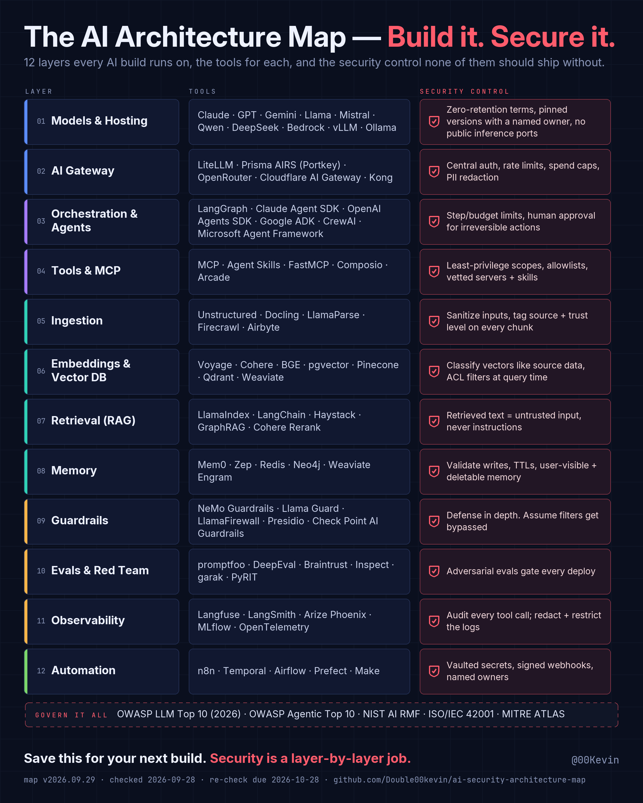

# ai-security-architecture-map

**The AI Architecture Map, with receipts.** A 12-layer map of what a production AI system is built from, the tools you'd reach for at each layer, and the one security control none of them should ship without, kept honest by a drift checker that re-verifies every tool against its own primary source every week. By [@00Kevin](https://x.com/00Kevin).

<!-- map:begin (generated by `python -m drift map build`; do not edit by hand) -->

[](maps/v2026.09.29/map.png)

Current version **v2026.09.29**, trusted until **2026-10-28**. Full text with receipts: [MAP.md](MAP.md).

| # | Layer | Tools | Security control |
|---|---|---|---|
| 01 | Models & Hosting | Claude · GPT · Gemini · Llama · Mistral · Qwen · DeepSeek · Bedrock · vLLM · Ollama | Zero-retention terms, pinned versions with a named owner, no public inference ports |
| 02 | AI Gateway | LiteLLM · Prisma AIRS (Portkey) · OpenRouter · Cloudflare AI Gateway · Kong | Central auth, rate limits, spend caps, PII redaction |
| 03 | Orchestration & Agents | LangGraph · Claude Agent SDK · OpenAI Agents SDK · Google ADK · CrewAI · Microsoft Agent Framework | Step/budget limits, human approval for irreversible actions |
| 04 | Tools & MCP | MCP · Agent Skills · FastMCP · Composio · Arcade | Least-privilege scopes, allowlists, vetted servers + skills |
| 05 | Ingestion | Unstructured · Docling · LlamaParse · Firecrawl · Airbyte | Sanitize inputs, tag source + trust level on every chunk |
| 06 | Embeddings & Vector DB | Voyage · Cohere · BGE · pgvector · Pinecone · Qdrant · Weaviate | Classify vectors like source data, ACL filters at query time |
| 07 | Retrieval (RAG) | LlamaIndex · LangChain · Haystack · GraphRAG · Cohere Rerank | Retrieved text = untrusted input, never instructions |
| 08 | Memory | Mem0 · Zep · Redis · Neo4j · Weaviate Engram | Validate writes, TTLs, user-visible + deletable memory |
| 09 | Guardrails | NeMo Guardrails · Llama Guard · LlamaFirewall · Presidio · Check Point AI Guardrails | Defense in depth. Assume filters get bypassed |
| 10 | Evals & Red Team | promptfoo · DeepEval · Braintrust · Inspect · garak · PyRIT | Adversarial evals gate every deploy |
| 11 | Observability | Langfuse · LangSmith · Arize Phoenix · MLflow · OpenTelemetry | Audit every tool call; redact + restrict the logs |
| 12 | Automation | n8n · Temporal · Airflow · Prefect · Make | Vaulted secrets, signed webhooks, named owners |

<!-- map:end -->

## Why this exists

Every "AI stack" diagram goes stale the week it's posted: tools get renamed, acquired, deprecated or shut down, and the picture never changes. This repo treats the map as data with evidence behind it, not as a picture:

- **Every tool is a claim with a receipt, and a review of that receipt.** `registry/claims.yaml` records, per tool, what the map asserts (and which kinds of assertion: capability, availability, ownership, lifecycle), where the proof is (the vendor's own docs, changelog or press release, the official GitHub organisation, or the package registry), the exact excerpt that was fetched, its SHA-256, the version seen and the fetch date, which assertions each receipt supports, and a review record: who read the evidence, when, and whether it supports the claim. The review is bound by hash to the exact claim, owner and evidence; change any of them and the review is void.
- **Drift is detected, not assumed.** `python -m drift check` re-fetches every source and flags a new version, a changed excerpt, a lifecycle signal the source publishes itself (npm `deprecated`, a yanked or Inactive PyPI release, an archived GitHub repo, release notes about deprecation or end of life), or a claim with no valid review in the last 30 days. Reports land in `reports/`, one pair of files per run.
- **Routine weeks publish themselves; judgment calls wait for a person.** Every Saturday the job re-checks every source. A claim whose sources changed only in version numbers and dates, and that a person reviewed and found supported in the last 180 days, is re-checked automatically. Anything else (a changed page, a lifecycle or ownership signal, a source that can't be reached, a claim edited since its review) is left for a person, and nothing about it changes until one decides. When the published map nears its re-check deadline, or a reviewed change alters what a reader sees, the job builds and pushes a new version, so the image at the top of this page updates without anyone touching it. It never changes a tool or label on its own.
- **AI triages; it never decides.** Claude classifies each flagged change as `affects_claim`, `noise` or `needs_human` to help the person who reads it. It never edits the registry, and automatic re-checks don't depend on it: they use a deterministic rule (only version numbers and dates changed).
- **Versions expire, and the clock starts at the evidence.** A map is built only from claims with a valid check: a person's `supported` review, or an automated re-check that carries it forward. Its `expires` date is the earlier of 30 days after the version date and 30 days after the oldest check behind it, so a fresh version number can't launder old evidence. The map and MAP.md say which checks were a person's and which were automated. CI fails on an expired map, the renderers refuse one (unless `--historical`), and a published version is never rewritten.
- **The picture is generated from the data.** The PNG and the videos in `maps/<version>/` are rendered from `map.json`. Renderer tests check text visibility and placement; `drift map verify` compares the committed PNG's decoded pixels and text sidecar with a fresh render. Videos are covered by renderer tests; a complete historical media manifest remains deferred.

Publication fails closed on invalid review chains, inconsistent dates, damaged images or operational failures. The weekly job requires a clean tracked and untracked checkout and verifies artifacts before committing. See [publication safety and recovery](docs/PUBLICATION.md), including the source-binding migration and the distinction between the 180-day renewal limit and the 30-day publication window.

## The 12 layers

The layers are capability areas, not a strict top-to-bottom pipeline, and not every system needs all of them (a build without retrieval has no layer 07; many have no separate memory layer). Roughly: 01–04 are what runs and what it can touch, 05–08 are what it knows, 09–12 are how you keep it honest and keep it running. Each layer's security control is the thing most builds skip; the map's thesis is that attackers don't hit your strongest layer, they hit the seam between two layers nobody owns.

| # | Layer | What it is |
|---|---|---|
| 01 | Models & Hosting | The models themselves and where they run: hosted APIs, cloud model platforms, and self-hosted serving. |
| 02 | AI Gateway | The single front door in front of every model call: auth, routing, rate limits, spend caps, redaction. |
| 03 | Orchestration & Agents | Frameworks that turn model calls into multi-step, tool-using workflows. |
| 04 | Tools & MCP | How agents reach the outside world: the Model Context Protocol, skills, and tool platforms. |
| 05 | Ingestion | Getting documents, pages and data sources into a form a model can use. |
| 06 | Embeddings & Vector DB | Turning content into vectors and storing them for similarity search. |
| 07 | Retrieval (RAG) | Finding the right context at the right moment and handing it to the model. |
| 08 | Memory | What the system remembers across sessions, and who can see or delete it. |
| 09 | Guardrails | Input/output filters, safety classifiers, PII detection, and agent-level defences. |
| 10 | Evals & Red Team | Testing behaviour before and after deploy, including adversarial testing. |
| 11 | Observability | Tracing, logging and metrics for every prompt, tool call and token. |
| 12 | Automation | The workflow engines that schedule and connect all of the above. |

The full map text with one receipt link per tool is in [MAP.md](MAP.md). The 12 controls live in `registry/controls.yaml`; they are the author's guidance, versioned and changelogged, and deliberately not auto-checked. The "govern it all" footer (`registry/governance.yaml`) names the frameworks the controls draw on; each entry has a review date and a review-due date.

## How a claim is checked

```yaml
- id: L02-litellm
  layer: 2
  tool: LiteLLM
  claim: LiteLLM is an actively maintained AI gateway ...   # what the map asserts, in words
  status: active            # active | renamed | acquired | deprecated | dead (lifecycle, not ownership)
  owner: null               # set only when a receipt shows it
  ownership_event: null     # {kind, counterparty, date, source_url, note}, e.g. an acquisition
  on_map: true              # false = verified candidate, checked weekly but not rendered
  assertions: [availability, lifecycle, capability]   # what kinds of thing the claim text asserts
  source_type: github_release   # github_release | github_tag | pypi | npm | rss | page_section
  source_url: https://github.com/BerriAI/litellm
  snapshot: BerriAI/litellm latest release v1.102.1 published 2026-09-23T06:12:28Z
  snapshot_hash: sha256:...
  last_version: v1.102.1
  fetched_at: '2026-09-27'  # written by `drift snapshot`; never counts as a review
  supports: [availability, lifecycle]   # what this receipt's excerpt actually evidences
  sources: [...]            # more receipts, each with its own snapshot and supports
  reviewed_at: '2026-09-28' # the review record: written only by a person via `drift review`
  reviewed_by: ...
  review_outcome: supported # supported | partial | unsupported
  review_hash: sha256:...   # over claim, tool, layer, status, owner, ownership_event, assertions,
                            # and every receipt's source_url, snapshot_hash and supports
```

A claim can go on a map only when every assertion has a receipt with a snapshot that supports it and the review is valid and `supported`.

Weekly, `drift check` fetches the source behind each receipt (only URLs already in the registry, HTTPS only, every redirect hop checked against the registry before it is followed and capped at 3, one 20 s end-to-end deadline, 8 MB cap, no JavaScript, polite user agent), extracts the same small piece of evidence, and compares. A receipt is flagged when:

- the source reports a **new version**,
- the located **page excerpt's hash changed**,
- the source publishes a **lifecycle signal** (deprecated, yanked, Inactive, archived, end of life),
- the claim has **no valid check (a person's review or an automated re-check) in the last 30 days**, or
- the source **can't be fetched** (a claim we can no longer prove).

Each run writes `reports/<run_id>.md` and `.json` (`run_id` is the UTC start time, `YYYY-MM-DDTHHMMSSZ`, plus the scope for partial runs), carrying the registry's sha256, the git commit, the claim text at check time and a digest of the report itself.

Flagged diffs go to `drift triage`, which asks Claude Haiku for one of `affects_claim | noise | needs_human` through one classification tool with no side effects (strict JSON schema; the model cannot edit the registry or run anything). Fetched text is treated as untrusted input: it's wrapped as data inside a fixed prompt; a heuristic filter keeps text that looks like injected instructions from being sent at all and routes it to a human, and a "noise" verdict on such text is overturned. The filter is a heuristic and will miss things; the containment is that the model has no tools with side effects and a human reviews. "Review due" and lifecycle signals are deterministic flags no model verdict can clear. Triage is bound to the report it read (run id and sha256) and refuses a report whose digest changed. Then a person reads the source, edits the claim, runs `drift snapshot` to take fresh evidence, reads it, records `drift review`, and the next weekly run publishes the change as a new dated version with a changelog entry.

After the check, `drift auto` (weekly job only) renews routine claims from the fresh evidence already in the report and publishes a new version when one is due; see "Why this exists" above for the rule. It writes `reports/<run>-auto.md`: what was re-checked automatically and why, and what is waiting for a person and why.

Proof means a primary source. Aggregators, "top tools" lists and AI answers are leads, never proof. Want to dispute a claim? Open a **Claim is stale** issue; the form requires a primary source URL.

## Quickstart

```bash
git clone https://github.com/Double00kevin/ai-security-architecture-map.git
cd ai-security-architecture-map
git config core.hooksPath .githooks   # gitleaks pre-commit hook; needs gitleaks on PATH
cp .env.example .env                  # then fill in values locally; .env is gitignored
python -m pip install --require-hashes -r requirements.txt
python -m drift check                 # compare every receipt with its stored evidence; writes reports/<run_id>.md + .json
python -m drift check --layer 6       # pre-project run for one layer
python -m drift check --dry-run       # print only, write nothing
python -m drift snapshot --id L02-litellm   # re-take that claim's evidence (voids its review if the evidence changed)
python -m drift review --status       # which claims can publish, and why not
python -m drift review --id L02-litellm --outcome supported --by <name>   # after reading the evidence
python -m drift triage                # Claude classifies each flagged diff in the newest report (needs ANTHROPIC_API_KEY in .env)
python -m drift auto --report reports/<run>.json   # weekly job: renew routine claims, publish a version when due
python -m drift map build --version vYYYY.MM.DD   # by hand: map.json + MAP.md + README table; refuses unreviewed evidence
python -m drift map check             # exit 1 if the newest map has expired
python -m drift map verify            # rebuild the newest version and diff it against the committed files
python render/render_map.py maps/vYYYY.MM.DD/map.json   # render the PNG (+ a .txt content manifest); refuses an expired map unless --historical
python render/render_video.py maps/vYYYY.MM.DD/map.json [--vertical]   # 40 s scene-per-layer MP4 (needs ffmpeg)
python -m pip install --require-hashes -r requirements-dev.txt && python -m pytest   # tests, no network
```

Works on Windows 11 and Linux with Python 3.11+ (`python` or `python3`). Python support: 3.11 and 3.13 are tested in CI on Ubuntu and Windows. The hash-pinned lockfiles are compiled for 3.11+; older interpreters will fail the `--require-hashes` install by design. `drift check` exit codes: 0 nothing flagged, 3 something flagged, 1 errors. `check` never modifies the registry; `snapshot` writes only evidence fields and never changes a claim's text, `status`, owner or review; `review` is the only writer of the review record; `auto` is the only writer of the automated re-check record and never touches claim text, status, owner or a person's review.

## Security posture

This repo applies its own layer 07 control to itself: **fetched content is untrusted input.**

- Vendor pages and diffs go to Claude as data, never as instructions: fixed system prompt, one classification tool with no side effects (strict JSON schema); the model cannot edit the registry or run anything. The injection filter is a heuristic; the containment is that the model has no tools with side effects and a human reviews. A page that says "ignore previous instructions" gets classified, not obeyed.
- The fetcher only fetches URLs that are already in the registry, over HTTPS, and checks every redirect hop against the registry before following it. One end-to-end deadline and a size cap per fetch. No JavaScript execution, no crawling, polite user agent, weekly cadence.
- Snapshots are short excerpts plus a hash, not full pages.
- Secrets never enter git. `.env` is gitignored and a gitleaks pre-commit hook has run since the first commit; CI runs the pinned, checksum-verified gitleaks CLI over the full history on every push and pull request.
- No infrastructure details (hostnames, addresses, usernames, local paths) in code, logs or reports.
- Dependencies are pinned with hashes and GitHub Actions to commit SHAs; Dependabot proposes, a named owner merges (the map's layer 01 control).

Found a problem? See `SECURITY.md`. Want to help? See `CONTRIBUTING.md`.

## Layout

```
MAP.md                  the map as text, one receipt link per tool (generated)
registry/claims.yaml    single source of truth (one record per tool)
registry/controls.yaml  the 12 security controls
registry/governance.yaml frameworks in the map footer
registry/copy.yaml      the words on the map that are not tools or controls
drift/                  checker CLI (check, snapshot, triage, map)
maps/vYYYY.MM.DD/       map.json + rendered PNG/MP4 per version
render/                 PNG and video renderers (Pillow; ffmpeg for video)
reports/                drift reports (one pair per run), triage, and review reports
scripts/                weekly job wrapper
tests/                  fixtures and tests (no network)
```

## License

- Code (`drift/`, `render/*.py`, `scripts/`, `tests/`, `.github/`, build files): [MIT](LICENSE).
- Map content (`registry/`, `maps/`, `reports/`, `MAP.md`, `CHANGELOG.md`, the wording of the 12 controls, and the rendered PNG/MP4): [CC BY 4.0](LICENSE-CONTENT). Repost, remix, translate, put it in your deck; credit @00Kevin and link back here.
- Fonts in `render/fonts/`: SIL Open Font License, see the licence files there.
